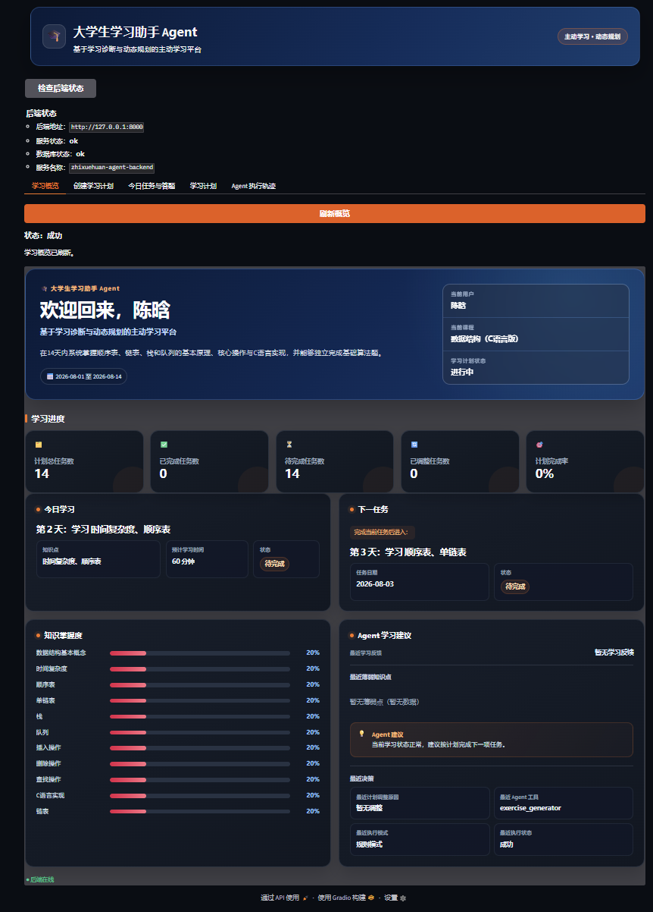
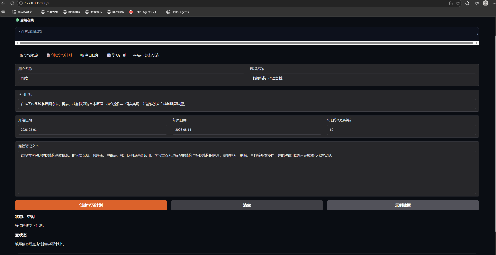
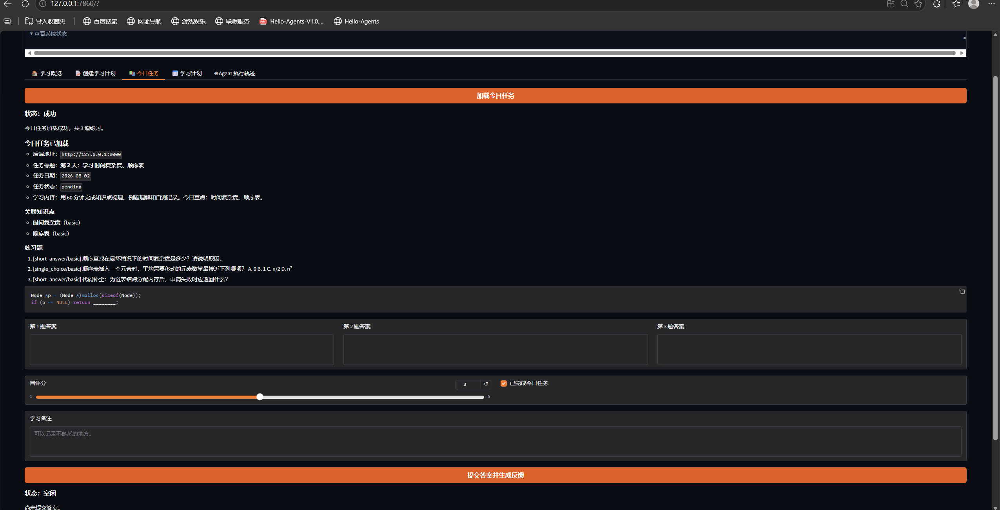
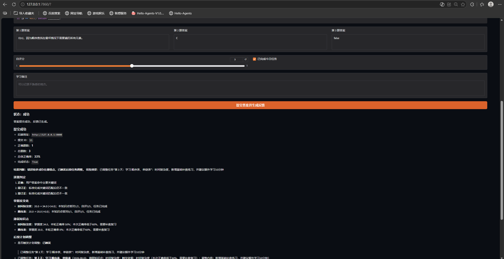
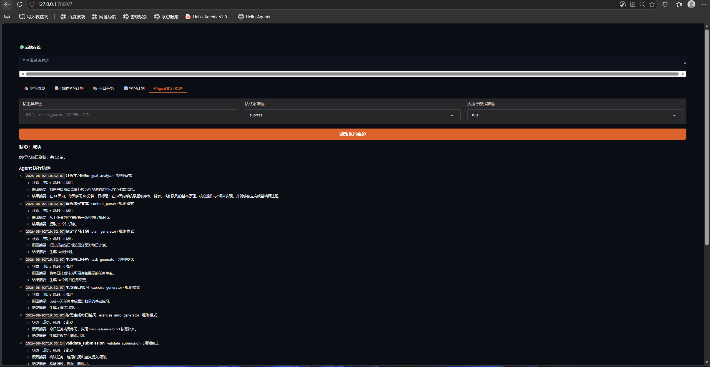

# 🎓 大学生学习助手 Agent

> 基于学习诊断与动态任务重规划的主动式大学生学习系统。

[](#)
[](https://www.python.org/)
[](#test-results)
[](#-项目简介)
[](#-license)

---

## ✨ 项目简介

大学生学习助手 Agent 是一个面向大学生自主学习场景的 Agent 应用。系统能够从课程资料和学习目标出发，生成每日学习安排与练习，并在用户提交答案后更新知识掌握度、识别薄弱点、调整后续任务，形成可持续迭代的学习闭环。

当前版本支持：

- 学习目标分析
- 课程知识点解析
- 学习计划生成
- 今日学习任务
- 练习生成
- 学习反馈
- 动态重规划
- Dashboard 学习概览
- Agent Trace 执行轨迹

项目默认使用确定性的 **Rule Mode**，无需外部模型即可完成演示。同时预留 **OpenAI Compatible** 接口；启用后若模型请求失败或结构化结果无效，系统会自动切换到 `fallback_rule`。默认配置不代表已调用真实 LLM 服务。

---

## 📸 Demo 展示

> Release 截图统一存放在 `docs/images/`。除 Dashboard 外，其余路径已作为后续截图占位。

| 学习概览 Dashboard | 创建学习计划 |
| --- | --- |
|  |  |

| 今日任务 | 学习反馈 |
| --- | --- |
|  |  |

| Agent 执行轨迹 |
| --- |
|  |

---

## 🚀 核心功能

| 模块 | 功能 |
| --- | --- |
| **Learning Plan** | 根据学习目标、计划日期和每日时长生成阶段计划与每日任务。 |
| **Content Parser V2** | 从课程笔记与学习目标中提取简洁、规范、可复用的知识点。 |
| **Exercise Generator V3** | 生成题型多样、难度递进且经过确定性去重的练习题。 |
| **Submission** | 评价用户答案，计算正确率并生成逐题学习反馈。 |
| **Knowledge Mastery** | 根据真实提交结果更新知识点掌握度并限制在合理区间。 |
| **Weak Point Detector** | 结合正确率和掌握度识别需要优先复习的薄弱知识点。 |
| **Dynamic Replanner** | 仅调整未来未完成任务，并记录清晰的调整原因。 |
| **Dashboard 2.0** | 汇总计划进度、今日任务、下一任务、知识掌握度和 Agent 建议。 |
| **Agent Trace** | 记录工具、执行模式、状态和必要元数据，便于演示与审查。 |

---

## 🏗 系统架构

系统采用 Gradio 表现层、FastAPI 服务层、Agent 编排与工具层、SQLite 数据层的分层结构。OpenAI Compatible LLM 是可插拔能力，不是默认演示环境的必要依赖。

完整 Mermaid 架构图与组件说明：

👉 **[查看系统总体架构](docs/architecture.md)**

---

## 🤖 Agent Workflow

系统包含“创建学习计划”和“学习反馈与动态重规划”两条主链路，形成以下闭环：

> 感知学习结果 → 分析学习状态 → 作出调整决策 → 修改未来计划 → 进入下一轮学习

完整 Mermaid 工作流图与规则分支：

👉 **[查看 Agent 工作流](docs/agent_workflow.md)**

---

## 📦 项目结构

```text
agent-backend/
├── app/                    # FastAPI、Agent 编排、工具、模型与可选 LLM 接口
├── demo/                   # Gradio Web Demo、API 客户端与页面格式化
├── tests/                  # 默认测试、集成测试与可选 live_llm 测试
├── docs/                   # 架构、工作流、API 契约和 Demo 文档
│   └── images/             # README 与 Release 截图
├── work/                   # 项目工作资料
├── data/                   # 本地运行数据
├── pyproject.toml          # 项目依赖与 pytest 配置
└── README.md               # GitHub 项目首页
```

---

## 🛠 技术栈


---

## ⚡ 快速开始

项目要求 Python 3.11 或更高版本。将 `<repository-url>` 替换为实际 Git 仓库地址。

### 1. 克隆项目

```powershell
git clone <repository-url>
cd agent-backend
```

### 2. 创建并激活虚拟环境

```powershell
python -m venv .venv
.\.venv\Scripts\Activate.ps1
```

### 3. 安装项目依赖

```powershell
python -m pip install -e .
```

如需运行测试，可安装开发依赖：

```powershell
python -m pip install -e ".[dev]"
```

### 4. 启动 FastAPI Backend

```powershell
python -m uvicorn app.main:app --host 127.0.0.1 --port 8000
```

### 5. 启动 Gradio Demo

在另一个终端中执行：

```powershell
python -m demo.app
```

浏览器访问：**<http://127.0.0.1:7860>**

默认 Rule Mode 配置示例：

```text
ZHIXUEHUAN_LLM_ENABLED=false
ZHIXUEHUAN_LLM_API_KEY=
```

环境变量的完整示例见 [`.env.example`](.env.example)。

---

## Test Results

安装开发依赖后运行：

```powershell
python -m pytest -q
```

Release v1.0 当前默认测试结果：

```text
182 passed, 1 deselected
```

- 默认测试全部通过。
- `live_llm` 为真实联网测试，默认排除。
- 当前项目运行于 Rule Mode，LLM 为可选 OpenAI Compatible 接口。

---

## 📈 Roadmap

- [x] Rule Agent
- [x] Dashboard 2.0
- [x] Learning Loop
- [x] Content Parser V2
- [x] Exercise Generator V3
- [ ] RAG
- [ ] 更多课程领域支持
- [ ] 历史学习统计与趋势
- [ ] 真实 LLM 服务接入与评估

---

## 📄 License

本项目采用 [MIT License](https://opensource.org/licenses/MIT)。
