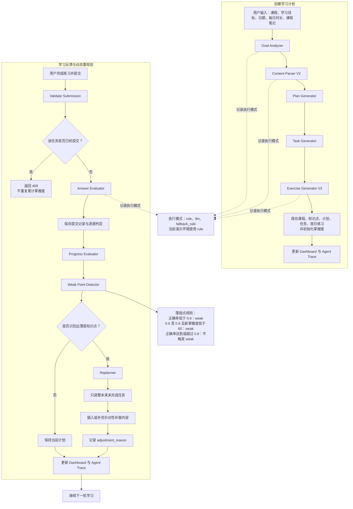

# Agent 工作流与学习闭环

下图展示当前实现的两条主链路：创建学习计划，以及答题后的学习反馈与动态重规划。

## 闭环含义

1. 系统感知用户提交的练习答案并计算正确率。
2. 系统按知识点更新掌握度，再根据正确率与新掌握度识别薄弱点。
3. 无薄弱点时保持计划；有薄弱点时只修改未来、未完成的任务，避免改写已完成任务或当天已提交任务。
4. 重规划会避免重复加入相同补救内容，并把薄弱知识点、触发依据和调整内容写入 `adjustment_reason`。
5. 每轮结果通过 Dashboard 和 Agent Trace 展示，形成“感知结果 → 分析状态 → 调整决策 → 修改未来计划 → 继续学习”的闭环。

## LLM 与规则模式

目标分析、内容解析和练习生成支持 `rule`、`llm`、`fallback_rule` 三种执行模式。当前演示使用规则模式；可选 LLM 的调用失败或返回无效结构化结果时，系统会使用 `fallback_rule` 完成同一流程。
