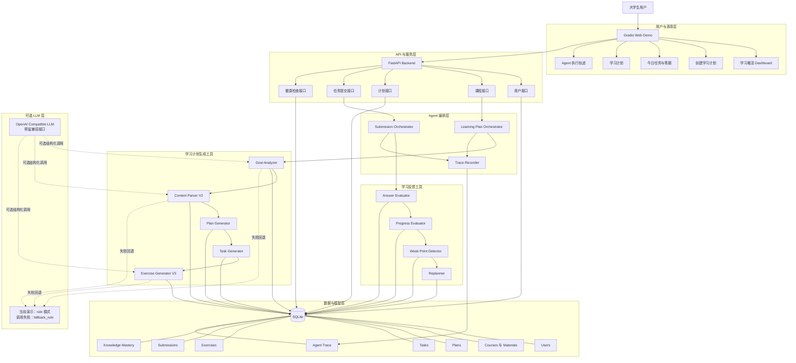

# 系统总体架构

本图只描述当前已实现的组件与数据流。当前演示默认使用规则模式；OpenAI Compatible LLM 是可选的兼容接口，不是系统运行的前提。

## 说明

- Gradio 通过现有 HTTP 接口读取计划、今日任务和轨迹，并提交答题结果；Dashboard 只展示这些真实数据与当前浏览器 session 的最近提交结果。
- `Learning Plan Orchestrator` 负责课程文本到计划、首日练习和掌握度初始值的创建链路；`Submission Orchestrator` 负责提交后的评价、掌握度更新、薄弱点识别和重规划。
- SQLite 保存用户、课程资料、知识点、计划、任务、练习、提交、掌握度记录和 Agent Trace。图中的 “Plans”“Tasks” 等是表的业务归类，不代表额外服务。
- 配置 LLM 时仅由目标分析、内容解析和练习生成使用结构化调用；请求失败、结构化校验失败或未配置时回退规则工具。当前文档不宣称已进行真实 LLM 调用。
